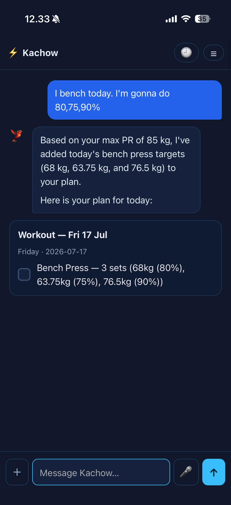
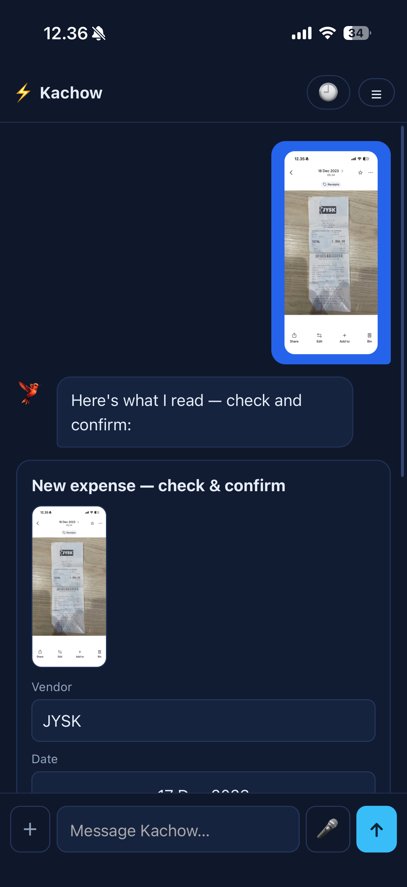

# Kachow - a personal AI assistant

Kachow is a self-hosted, bilingual (English + Danish) personal assistant built around
Google Gemini tool-calling. You talk to it in plain language and it *does things* -
logs a workout, reads a receipt photo, turns a photographed note into a calendar event,
checks your calendar, drafts an email, tracks a cycle - rendering the result as an
interactive card in the chat rather than a wall of text.

This repository (`kachow-app`) is the **brain**: the domain logic, data layer, tool
definitions and the Gemini loop. The web front-end / PWA lives in a companion repo,
[`kachow-web`](https://github.com/christianmorkeberg/kachow-web), which consumes these
classes.

> A personal project - built to actually use daily, not as a demo. Two real users
> (one English, one Danish), which is why bilingual routing and per-user data are
> first-class concerns.

## Screenshots

| Ask for your plan | Snap a receipt | Summarise email |
|---|---|---|
|  |  |  |
| *“What should I bench today?” → pulls your training plan as a tickable checklist card.* | *A receipt photo → Gemini reads it into an editable expense card (vendor, total, VAT, line items) you confirm in one tap.* | *“What’s my newest email about?” → fetches + summarises, with the full message rendered safely.* |

## What makes it interesting

- **Tool-calling with 90+ tools, kept precise.** Sending every tool on every request
  hurts model accuracy, so a deterministic `ToolSelector` narrows ~90 tools across 20
  domains down to the handful relevant to each message (bilingual keyword routing),
  falling back to everything only when genuinely ambiguous. Routing is guarded by a
  **self-test** (`bin/routing-test.php`, 120 fixtures) so a missed Danish phrase is
  caught before deploy, not in production.
- **“Card in chat”, in a persistent panel.** Any tool can return a `_render` payload;
  the loop captures it, strips it from the model’s context (so the model summarises
  rather than re-lists), and the web layer draws it as an interactive widget - a tickable
  workout plan, an editable receipt, an animated weather card, a menstrual-cycle ring, etc.
  Cards live in a **foldable panel** above the composer that updates in place: adding a
  grocery item just refreshes the list instead of re-posting the whole thing, and switching
  topic swaps the card - keeping the chat itself a clean running log.
- **Hand-rolled data-viz, no chart library.** The interactive charts - a workout-progression
  line chart (est-1RM / top-set / volume, tested maxes vs Epley estimates), a work-hours bar
  chart (per day / week / month), the cycle ring - are drawn as inline SVG in vanilla JS,
  tap-to-inspect on mobile and `prefers-reduced-motion` aware. Each chart is a `Data` method
  that shapes points server-side + a small render function, reused across cards.
- **Vision, two ways.** Receipt photos take a *structured* path: Gemini in JSON mode
  returns typed expense fields (line items, multi-currency, duplicate detection) the user
  confirms before anything is booked. *Any other* photo - a note on the building’s board,
  a poster, an invitation - takes an *open* path: it’s fed straight into the tool-calling
  loop, so the model reads it and acts with the same tools as a typed request (a calendar
  event, a list item, a reminder), asking first via a quick-reply chip when a detail is
  ambiguous. Same infrastructure, no receipt-specific schema.
- **Self-written IMAP + SMTP clients.** PHP 8.4 removed `ext-imap`, so the mail stack is
  pure-PHP (TLS sockets, literal-aware IMAP reader, dot-stuffing SMTP) behind a single
  `EmailProvider` interface - alongside Gmail (API) and Outlook (MS Graph) providers.
- **Security by construction.** Every `Data/` query is hard-scoped to the acting user;
  *all* cross-user access - reads, plus a single explicit-grant write (logging a workout
  on a connection’s behalf) - goes through one audited `ConnectionAccess` gate (an
  accepted connection + an explicit per-scope share). OAuth refresh tokens are encrypted
  at rest with libsodium `secretbox`. Secrets live in `.env`, never in the repo.

## Features

- **Fitness** - workout logging, dynamic training plans as tickable checklists, and a
  progression chart per exercise (with per-user name canonicalisation so “squat/squats/backsquat”
  or “deadlift/dødløft” don’t fragment your history). With a connection’s permission you can
  view *their* progression chart too, or log a workout on their behalf (an explicit, audited
  write grant separate from read-sharing).
- **Lists** - shared shopping / to-do lists with real checkboxes and loose name-matching.
- **Calendar** - Google Calendar agenda cards, availability answers, event creation.
- **Weather** - animated symbol cards, current + forecast, from DMI with an automatic
  **Open-Meteo fallback** (so rate-limits or non-Danish locations still resolve - it works worldwide).
- **Expenses** - receipt photo → editable expense card, line items, CSV export for the accountant.
- **Vision** - snap *any* photo and the assistant reads it and acts: a note, poster or
  invitation becomes a calendar event, a shopping-list item or a reminder (receipts stay
  the dedicated expense path).
- **Work** - geofenced clock-in/out hours, a bar chart of hours over a period (day/week/month),
  and a free-text “what I did” work log per job.
- **Cycle** - menstrual-cycle tracking (inner-seasons visualisation), predictions, mood/energy logging, opt-in partner sharing.
- **Email** - Gmail / Outlook / IMAP: read, search, draft, confirm-to-send, safe HTML rendering,
  and mark-as-read (on open, or “mark them all as read” in bulk).
- **Music** - vinyl collection with Discogs enrichment and taste-based recommendations.
- **Personalisation** - durable memory + standing instructions injected into the system prompt.
- **Notifications & reminders** - Web Push (PWA), a modular notification-type registry, cron-driven
  nudges that deep-link to the matching card, one-off reminders, and a daily AI pass that personalises
  the home-screen starters.

## Architecture

A deliberately framework-free, layered PHP app (PSR-4, `App\` → `src/`):

```
Database (PDO/MySQL, utf8mb4)
   └── Data/       SQL only, hard per-user scoping        (Workouts, Receipts, CycleTracker, …)
        └── Tools/  thin wrappers implementing Tool        (LogWorkout, AddExpense, GetCycleStatus, …)
             └── Assistant/  the Gemini tool-call loop     (AssistantLoop, GeminiClient, ToolSelector)
```

The `AssistantLoop` builds the conversation, asks `ToolSelector` for the relevant tool
declarations, calls Gemini, executes any requested tools (each `Data`-backed and
user-scoped), feeds results back, and repeats until the model produces a final reply -
capturing any `_render` card along the way.

## Tech stack

PHP 8.4 · MySQL/MariaDB · Google Gemini (raw cURL, function-calling + JSON mode) ·
libsodium (token encryption) · Web Push / VAPID · Composer · a vanilla-JS PWA
(`kachow-web`). No web framework - the layering *is* the structure.

## Repository layout

```
src/
  Assistant/   AssistantLoop, GeminiClient, ToolSelector, generators
  Data/        per-user data access (one class per domain)
  Tools/       one thin Tool per capability + the ToolRegistry
  Email/       EmailProvider interface + Gmail / Outlook / IMAP + SMTP clients
  Auth/        sessions, remember-me, Google/Microsoft OAuth
  Notify/      Web Push + modular notification types
  Receipts/    image storage + Gemini receipt reader
bin/           cron jobs (notifications, reminders, daily starters) + routing self-test
migrations/    plain .sql, applied by hand per environment
```

## Running it

```bash
composer install
cp .env.example .env          # then fill in the values
# create the DB, then apply migrations/ in date order
php bin/routing-test.php      # sanity-check tool routing (no DB/API needed)
```

Serve the [`kachow-web`](https://github.com/christianmorkeberg/kachow-web) front-end
(its `bootstrap.php` autoloads this repo). Schedule the crons:

```cron
0,30 * * * *  php /path/to/kachow-app/bin/notify-cron.php        >/dev/null 2>&1   # every 30 min
*/5  * * * *  php /path/to/kachow-app/bin/reminders-cron.php     >/dev/null 2>&1   # one-off reminders
30 4 * * *    php /path/to/kachow-app/bin/quick-actions-cron.php >/dev/null 2>&1   # daily starters
```

## Tests

```bash
php bin/routing-test.php   # deterministic tool-routing regression suite (EN + DA)
```

---

Built by [Christian Mørkeberg](https://github.com/christianmorkeberg) as a personal
project. Not affiliated with any company; the “Kachow” name is just for fun.
